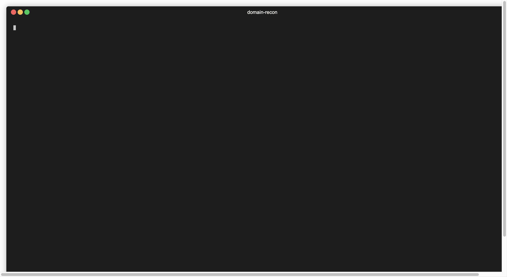

# domain-recon-rs

## Intro

`domain-recon-rs` is a tool which can be used for passive host reconnaissance. It helps extend the attack surface by
fetching all the available active certificates for the host. Using certificate parsing, it extracts
all available domains from "Common Name" and "Matching Identities" fields.
Moreover, in a lot of cases, it may encounter certificates issued for wildcard domains (example: `*.example.com`).
For these domains, it can use a word list to extend these wildcards by filling in words from the list and generate
potential subdomains.

For more information, please read the blogpost: [https://ervinszilagyi.dev/articles/certificate-parsing-with-domain-recon](https://ervinszilagyi.dev/articles/certificate-parsing-with-domain-recon)

### Example of usage:

```bash
domain-recon -d wikipedia.org -f words.txt
```

**Note**: an example of [`words.txt`](words.txt) can be found here: [https://raw.githubusercontent.com/recon-tools/domain-recon-rs/main/words.txt](https://raw.githubusercontent.com/recon-tools/domain-recon-rs/main/words.txt)



Currently, certificates are fetched from [crt.sh](https://crt.sh/) and [censys](https://search.censys.io/api). By default,
`domain-recon` will use crt.sh only, censys and certspotter being additional options. In order to use censys or certspotter,
we have to provide a configuration file, that contains our API credentials. `domain-recond` reads this information from 
the `$HOME/.config/domain-recon/config.json` folder. The structure of this file should be as follows:

config.json
```json
{
    "censys": [
        {
            "app-id": "84f2fe92-9c4e...",
            "secret": "bmwjq...."
        }
    ],
    "certspotter": [
        {
            "api-key": "k47370_..."
        }
    ]
}
```

### All the Arguments

```bash
$ domain-recon -h
Extract domains and subdomains from certificates.

Usage: domain-recon [OPTIONS] --domain <DOMAIN>

Options:
  -d, --domain <DOMAIN>
          Domain name to be scanned
  -f, --file <FILE>
          Optional path to a words file used for expand wildcard domains. If there is no path provided, there will be no attempt to expand wildcard domains
  -p, --plain
          Display results in plain form (no banner, no color)
      --domains-only
          Display a plain list with domain names only
      --ips-only
          Display a plain list with unique IP addresses only
      --csv
          Save output to csv
      --use-system-resolver
          Use default system DNS resolver
      --dns-resolver <DNS_RESOLVER>
          Specify a remote DNS resolver. Allowed values are: google, cloudflare, quad9. Default is google .Can contain multiple values delimited by comma, ex --dns-resolver="google,cloudflare,quad9" [default: google]
      --provider <PROVIDER>
          Certificate provider. Allowed values are: certsh, censys, certspotter. Default is certsh. Can contain multiple values delimited by comma, ex --provider=certsh,censys,certspotter [default: certsh]
  -c, --config <CONFIG>
          Optional path to config file. If no path is given, certificate providers such as censys or certspotter can not be used
  -n, --number-of-parallel-requests <NUMBER_OF_PARALLEL_REQUESTS>
          Number of maximum parallel requests when doing DNS resolution [default: 10]
  -h, --help
          Print help information
  -V, --version
          Print version information
```

## Download and Install

### Ubuntu/Debian

- Add the following PPA:

```
curl -s --compressed -L "https://recon-tools.github.io/ppa/debian/KEY.gpg" | sudo apt-key add -
sudo curl -s --compressed -L -o /etc/apt/sources.list.d/recon_tools.list "https://recon-tools/ppa/debian/recon_tools.list"
sudo apt update
```

- Install using `apt-get`:

```
sudo apt install domain-recon
```

### MacOS/Windows

We can download the executable from the releases page: [https://github.com/recon-tools/domain-recon-rs/releases](https://github.com/recon-tools/domain-recon-rs/releases)
Make sure we choose the right executable for our OS/architecture.

Or we can simply build the project.

## Building the Project

This project requires **Rust 1.64** or above.

```bash
cd domain-recon-rs
cargo build --release
```
